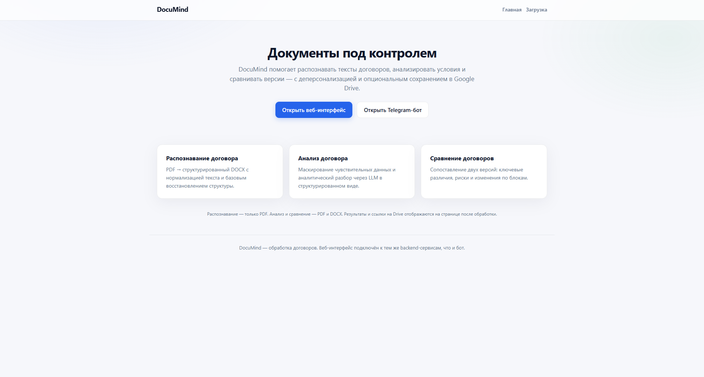
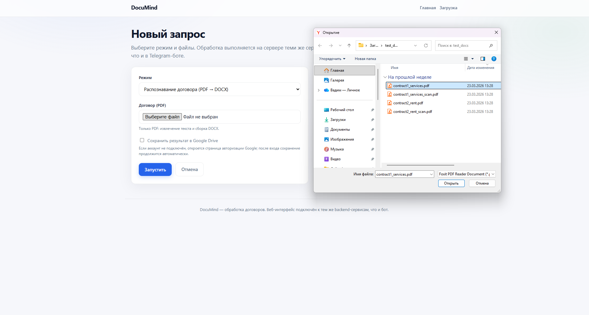
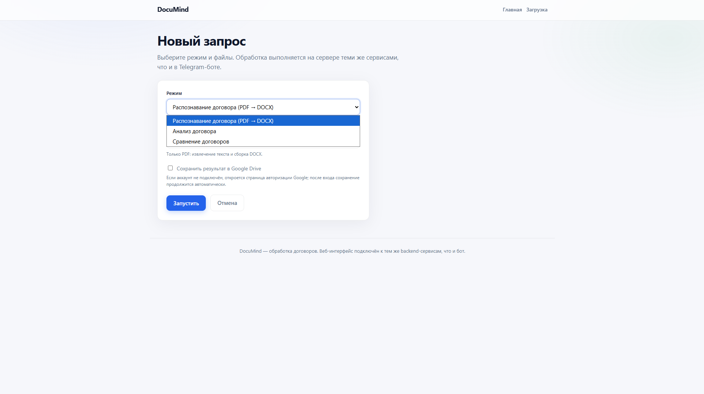
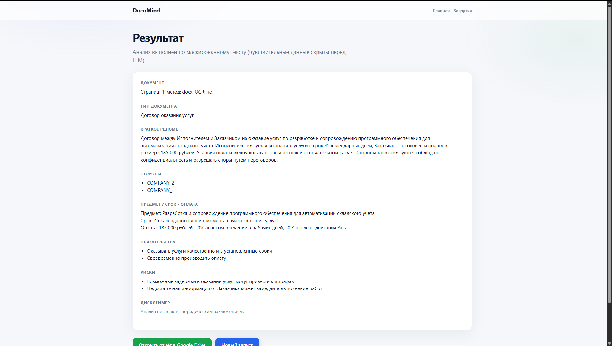
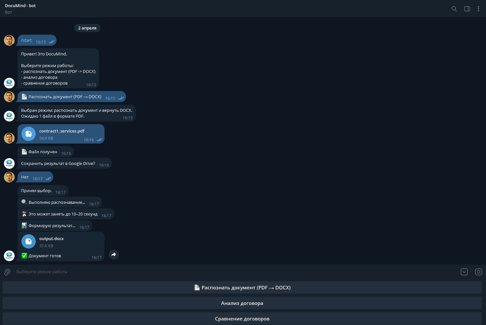
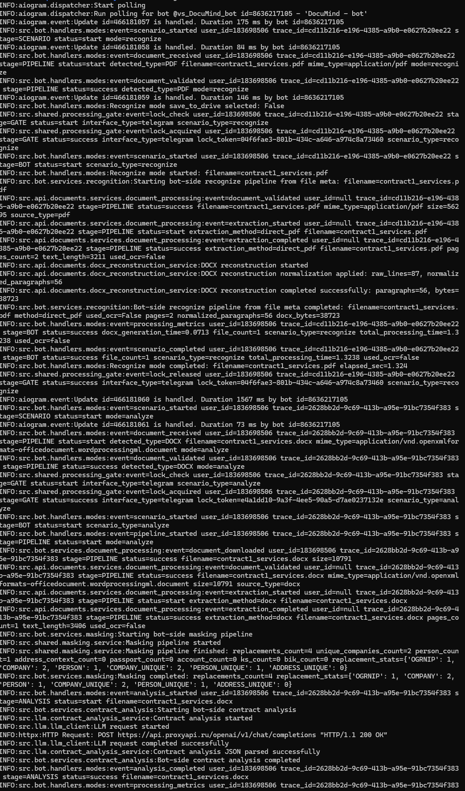
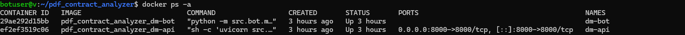
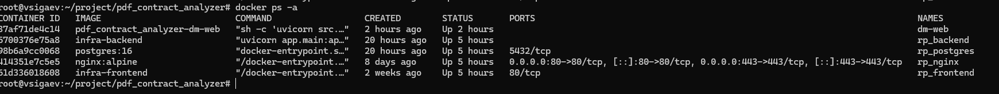
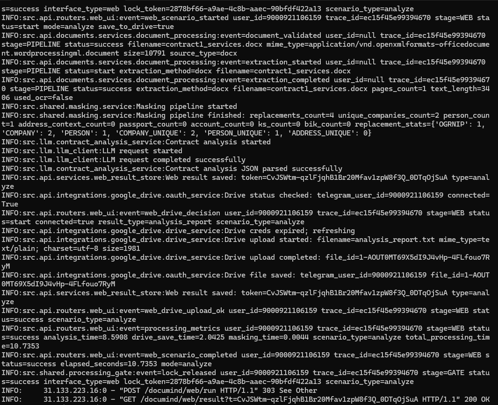

# DocuMind

DocuMind — MVP-сервис для обработки PDF-договоров с модульной архитектурой.

Сервис реализует полный pipeline обработки документов:
- извлечение текста (PDF/DOCX)
- OCR fallback для сканированных документов
- деперсонализация (masking)
- анализ и сравнение через LLM
- генерация DOCX
- опциональное сохранение в Google Drive

Доступны два интерфейса:
- Web UI
- Telegram-бот

---

## 🏗 Архитектура

Система построена по принципу единого backend с несколькими интерфейсами.

### Компоненты:

- **dm-api** — FastAPI backend (основная бизнес-логика)
- **dm-bot** — Telegram-бот (aiogram)
- **dm-web** — Web UI (Jinja2 + CSS)
- **nginx** — reverse proxy (раздача web + SSL)

### Инфраструктура:

- **Server 1**:
  - backend (dm-api)
  - Telegram-бот (dm-bot)

- **Server 2**:
  - web UI (dm-web)
  - nginx

---

## 📡 Interface parity

Все сценарии выполняются через единый backend pipeline.

Метрики одинаковы для Web и Telegram, так как:
- используется один и тот же document pipeline
- одинаковые этапы обработки:
  - extraction → masking → LLM → post-processing
- различается только интерфейс

Telegram-бот дополнительно отображает пользователю статусы этапов обработки,  
в то время как Web UI скрывает технические детали.

---

## ⚙️ Основные функции

### 1. Распознавание (PDF → DOCX)
- извлечение текста из PDF
- OCR fallback (Tesseract, `rus+eng`)
- нормализация текста
- восстановление структуры
- генерация DOCX

### 2. Анализ договора
- извлечение текста
- masking чувствительных данных
- LLM-анализ
- структурированный вывод

### 3. Сравнение договоров
- обработка двух документов
- masking
- LLM-сравнение
- структурированный результат

---

## 🔐 Masking (деперсонализация)

Поддерживается замена:

- email, phone
- ИНН / КПП / ОГРН
- банковские реквизиты
- адреса
- ФИО
- названия организаций

Используется span-based подход (без `str.replace`),  
что исключает ошибки пересечения замен.

---

## ☁️ Google Drive OAuth

Реализован OAuth 2.0:

- отдельные namespace:
  - `/google-drive/...` (web)
  - `/google-drive-bot/...` (bot)
- поддержка pending операций
- автоматическое завершение после callback

---

## 🔒 Обработка и синхронизация

Для предотвращения параллельной тяжелой обработки используется:

- **shared lock (SQLite)**
- файл: `data/processing_lock.sqlite3`

Логируются события:
- `lock_check`
- `lock_acquired`
- `lock_busy`
- `lock_released`

---

## 📊 Метрики и производительность

| Scenario     | File Type | Size | OCR | Time (s) | Notes |
|--------------|----------|------|-----|----------|------|
| Recognize    | PDF      | 55 KB| No  | 0.06     | text PDF |
| Recognize    | PDF      |361 KB| Yes | 21.4     | OCR |
| Analyze      | DOCX     | 11 KB| No  | 6.6      | LLM |
| Analyze      | PDF      | 55 KB| No  | 7.3      | LLM |
| Analyze      | PDF      |361 KB| Yes | 27.7     | LLM |
| Compare      | DOCX x2  | 11 KB| No  | 10.1     | 2 docs |
| Compare      | DOCX+PDF | 66 KB| No  | 7.3      | 2 docs |
| Compare      | PDF x2   |704 KB| Yes | 26.8     | 2 docs |

---

## ⚙️ Системные характеристики

- VPS: 1 GB RAM / 1 CPU
- RAM usage: ~500–600 MB
- Swap: используется при нагрузке
- CPU: низкая загрузка (~1–5%)

Сервис способен работать в условиях ограниченных ресурсов.

---

## 📂 Хранение данных

- Web результаты:
  - `data/web_ui_results/<token>/`
- Google Drive tokens:
  - `data/google_drive_tokens.sqlite3`
- Lock:
  - `data/processing_lock.sqlite3`

---

## 📸 Демонстрация работы
> Ниже представлены реальные скриншоты работы системы в ходе тестирования MVP

### 🌐 Web-интерфейс

#### Главная страница

*Главная страница web-интерфейса сервиса - https://vsigaev.ru/documind/web*

#### Загрузка документа

*Окно загрузки документа*

#### Выбор сценария

*Страница выбора режима работы сервиса*

#### Результат анализа

*Результат выполнения анализа договора*

---

### 🤖 Telegram-бот

#### Основной сценарий работы

*Пример выполненного сценария распознавания pdf-документа*

#### Логи обработки

*Логи бота - распознавание pdf-документа*

---

### ⚙️ Инфраструктура

#### Контейнеры Docker backend-сервера


#### Контейнеры Docker web-сервера


#### Логи сервиса

*Логи процесса анализа договора с сохранением в Google Drive*

---

## 🚀 Запуск

```bash
docker compose up --build
```

Проверка:

GET /health
GET /ping

---

## 🧪 Тестирование
Telegram:
отправка PDF
выбор режима
получение результата

Web:
загрузка файла
выбор режима
получение результата

---

## ⚠️ Ограничения MVP
Распознавание: только PDF
OCR сильно увеличивает время обработки
Нет очереди задач (используется lock)
Нет масштабирования

---

## 🚀 Roadmap / Future Improvements
### 🏗 Архитектура
Полное разделение backend и UI
Выделение LLM и Google Drive интеграций в отдельные сервисы
Введение очереди задач (Celery / workers)
### ⚙️ Инфраструктура
Перенос backend на более мощный сервер
Оптимизация потребления памяти
Добавление мониторинга (Prometheus / Grafana)
### 📄 Функциональность
Поддержка новых типов документов
Улучшение качества анализа
Извлечение ключевых параметров (структурированные данные)
Генерация отчетов

---

## 📌 Статус

Проект находится на стадии MVP и демонстрирует полный цикл обработки документов
с разделением интерфейсов и единой backend-логикой.